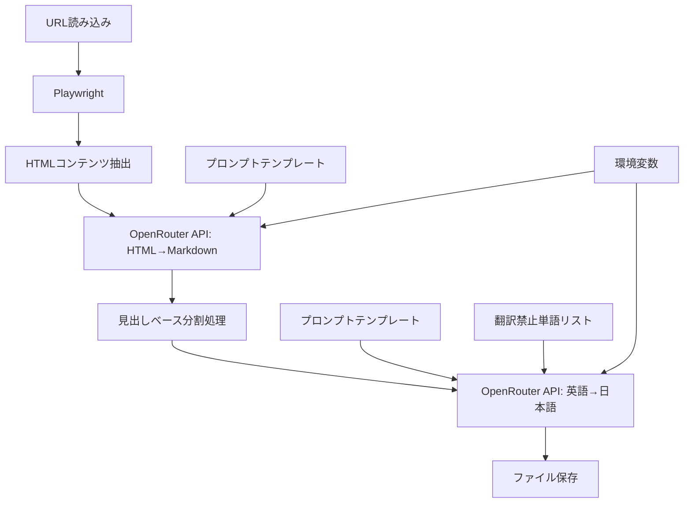

# HashiCorp Docs 翻訳ツール - システムパターン

## システムアーキテクチャ

このツールは、以下の主要コンポーネントで構成されるパイプラインアーキテクチャを採用しています：

```
URL取得 → HTMLコンテンツ抽出 → Markdown変換 → 分割処理 → 日本語翻訳 → ファイル保存
```

### コンポーネント詳細

1. **URL取得・HTMLコンテンツ抽出**
   - Playwrightを使用してウェブページにアクセス
   - DOMから`#main`要素を特定し、メインコンテンツを抽出
   - ヘッドレスブラウザを使用することで、JavaScript実行後のコンテンツを取得可能

2. **Markdown変換**
   - OpenRouter APIを使用してHTMLをGitHub Flavored Markdownに変換
   - 専用のプロンプトテンプレート（`html_to_english_markdown.txt`）を使用

3. **分割処理**
   - 大きなドキュメントを見出し（H1, H2）や段落に基づいて分割
   - 最大5000文字のチャンクに分割し、トークン制限内に収める
   - 論理的な構造（章や節）を尊重した分割

4. **日本語翻訳**
   - OpenRouter APIを使用して英語Markdownを日本語に翻訳
   - 専用のプロンプトテンプレート（`english_markdown_to_japanese.txt`）を使用
   - 翻訳禁止単語リストを適用

5. **ファイル保存**
   - URLのパス構造を反映したファイル構造で保存
   - 原文（英語）と翻訳文（日本語）を別々のファイルとして保存

## 主要な設計パターン

### 1. パイプラインパターン
各処理ステップが順次実行され、前のステップの出力が次のステップの入力となるパイプライン構造を採用しています。これにより、各コンポーネントの責務が明確に分離され、保守性が向上します。

### 2. 設定の外部化
APIキー、モデル名、プロンプトファイルパスなどの設定を環境変数として外部化し、`.env`ファイルで管理しています。これにより、コードを変更せずに設定を変更できます。

### 3. テンプレート注入
プロンプトテンプレートにコンテンツやパラメータを注入するパターンを使用しています。これにより、プロンプトの内容をコードから分離し、柔軟に調整できます。

### 4. 再帰的分割戦略
大きなコンテンツを処理する際に、階層的な分割戦略（H1見出し → H2見出し → 段落）を採用しています。これにより、コンテンツの論理構造を保持しつつ、適切なサイズに分割できます。

## コンポーネント間の関係



## 重要な実装パス

### 1. URL処理とHTMLコンテンツ抽出

```typescript
// URLリストを読み込み
const urls = fs.readFileSync(urlsFilePath, 'utf-8').split('\n').filter(url => url.trim() !== '');

// 各URLに対して処理
for (const url of urls) {
  const page = await context.newPage();
  await page.goto(url, { waitUntil: 'domcontentloaded', timeout: 3000 });
  const mainContentElement = await page.$('#main');
  const htmlContent = await mainContentElement.innerHTML();
  // ...
}
```

### 2. OpenRouter APIを使用したテキスト処理

```typescript
async function processTextWithOpenRouter(prompt: string, content: string, taskDescription: string): Promise<string> {
  // プロンプトテンプレートにコンテンツを挿入
  const fullPrompt = prompt.replace('{html_content}', content)
                          .replace('{markdown_content}', content)
                          .replace('{do_not_translate_words}', doNotTranslateSection);

  // OpenRouter APIにリクエスト
  const response = await axios.post(
    "https://openrouter.ai/api/v1/chat/completions",
    {
      model: OPENROUTER_MODEL_NAME,
      messages: [{ role: "user", content: fullPrompt }],
    },
    {
      headers: {
        "Authorization": `Bearer ${OPENROUTER_API_KEY}`,
        "Content-Type": "application/json"
      },
      timeout: 180000
    }
  );
  
  return response.data.choices[0].message.content.trim();
}
```

### 3. 見出しベースの分割処理

```typescript
function splitMarkdownByHeadings(markdown: string, maxChunkSize: number = 5000): string[] {
  // H1見出しで分割
  const h1Pattern = /^# .+$/m;
  const h1Sections = [];
  
  // H1見出しがない場合や大きすぎる場合はH2見出しで分割
  // H2見出しもない場合や大きすぎる場合は段落で分割
  // ...
  
  return h1Sections;
}
```

### 4. ファイルパス生成とファイル保存

```typescript
// URLからパス部分を抽出
const urlObject = new URL(url);
let urlPath = urlObject.pathname;

// パス部分から不要な接頭語を除去
let relativePath = urlPath;
if (relativePath.startsWith('/vault/docs/')) {
  relativePath = relativePath.substring('/vault/docs/'.length);
}

// ファイル名として使用できる形式に変換
const baseFilename = relativePath.replace(/[^\w.\/-]/g, '');

// ファイルパスを生成
const originalFilename = baseFilename + '_original.md';
const originalOutputFilePath = path.join(originalOutputDir, originalFilename);

// ディレクトリが存在することを確認
fs.mkdirSync(path.dirname(originalOutputFilePath), { recursive: true });

// ファイルに書き込み
fs.writeFileSync(originalOutputFilePath, englishMarkdown, 'utf-8');
```

## エラーハンドリング戦略

1. **try-catchブロック**: 各URLの処理は個別のtry-catchブロックで囲まれており、1つのURLの処理が失敗しても他のURLの処理は継続されます。

2. **タイムアウト設定**: API呼び出しやページ読み込みにタイムアウトを設定し、無限待機を防止しています。

3. **ファイル存在チェック**: ファイル読み込み前に存在チェックを行い、ファイルが見つからない場合はフォールバックコンテンツを使用します。

4. **ディレクトリ作成**: ファイル書き込み前に親ディレクトリの存在を確認し、必要に応じて再帰的に作成します。

## パフォーマンス考慮事項

1. **並列処理の制限**: 現在は各URLを順次処理していますが、将来的には並列処理を導入してパフォーマンスを向上させる可能性があります。

2. **チャンクサイズの最適化**: 5000文字という現在のチャンクサイズは、APIのトークン制限とパフォーマンスのバランスを考慮して設定されています。

3. **タイムアウト値**: API呼び出しのタイムアウトは3分（180000ミリ秒）に設定されており、大きなドキュメントの処理に対応しています。

4. **メモリ使用量**: 大きなドキュメントを処理する際のメモリ使用量を考慮し、ストリーミング処理の導入を検討する可能性があります。
